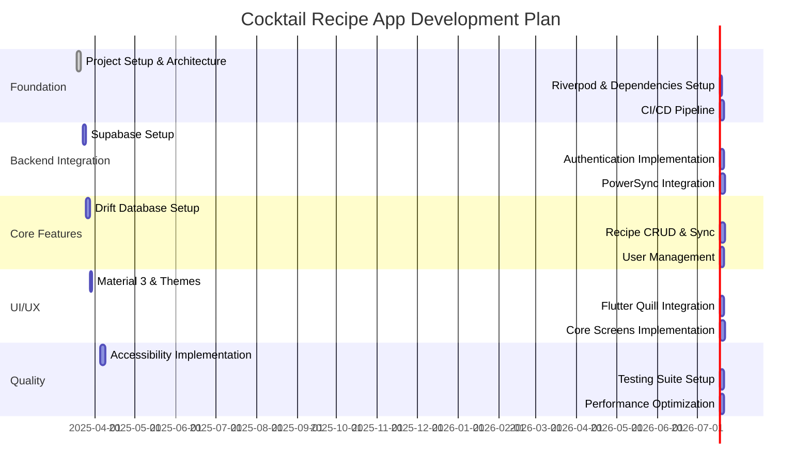

# Implementation Plan

This file outlines the development roadmap and implementation strategy.

2025-03-18 21:48:27 - Updated with technology-specific implementation details

## Project Timeline

## Implementation Phases

### 1. Foundation Phase
* Development Setup
  - Flutter & Dart configuration
  - Riverpod installation
  - Dependency setup
  - Code formatting rules

* Architecture Implementation
  - Clean Architecture structure
  - Riverpod providers setup
  - Base controllers
  - Common utilities

### 2. Backend Integration
* Supabase Setup
  - Project configuration
  - API keys management
  - Schema design
  - Real-time channels

* Authentication Flow
  - User registration
  - Login/logout
  - Password recovery
  - Session management

* PowerSync Integration
  - Offline-first setup
  - Sync configuration
  - Conflict resolution
  - Background operations

### 3. Core Features
* Drift Database
  - Schema definition
  - Migration setup
  - CRUD operations
  - Query optimization

* Recipe Management
  - Data models
  - Sync logic
  - State management
  - Offline support

* User Features
  - Profile handling
  - Settings storage
  - Preferences sync
  - Account management

### 4. UI/UX Development
* Material 3 Setup
  - Custom theme
  - Icon configuration
  - Color schemes
  - Typography

* Flutter Quill
  - Editor setup
  - Localization
  - Toolbar customization
  - State preservation

* Screen Implementation
  - Navigation system
  - Responsive layouts
  - Form patterns
  - List/Grid views

### 5. Quality Assurance
* Accessibility
  - Screen reader support
  - Color contrast
  - Theme testing
  - Navigation aids

* Testing Implementation
  - Unit tests
  - Widget tests
  - Integration tests
  - Sync testing

* Performance
  - Load time
  - Memory usage
  - Sync efficiency
  - UI responsiveness

## Technical Dependencies
* Primary:
  - riverpod: State management
  - supabase: Backend services
  - drift: Local database
  - powersync: Data synchronization
  - flutter_quill: Rich text editing
  - dio: HTTP client
  - shared_preferences: Local storage

* Development:
  - build_runner: Code generation
  - freezed: Immutable models
  - json_serializable: JSON handling
  - mockito: Testing utilities