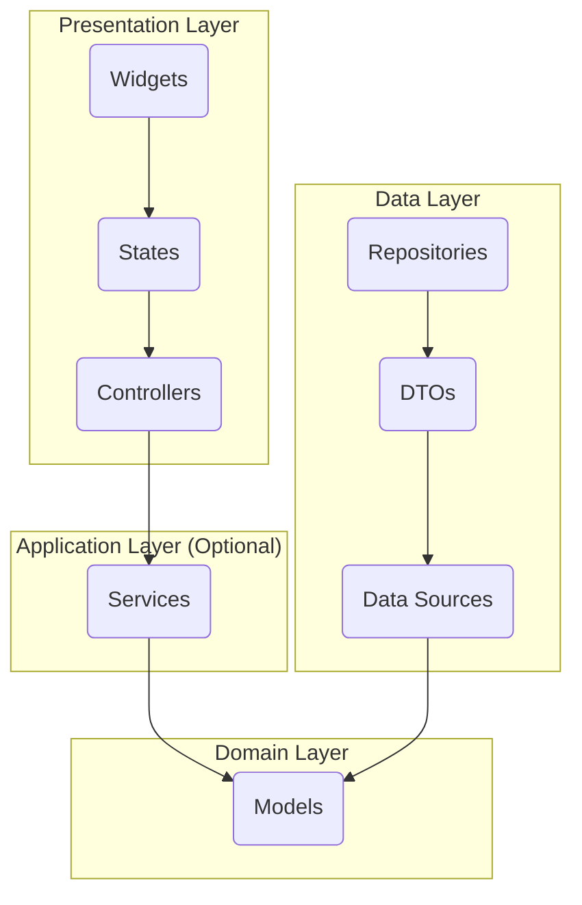

# Functional Tech Requirements

## Tech & Libraries
- Language: Dart & Flutter
- State management: Riverpod (https://riverpod.dev/docs/introduction/getting_started)
- Backend: Supabase (https://supabase.com/docs/reference/dart/introduction)
- Database: Drift (https://drift.simonbinder.eu/setup/)
- Data Sync: PowerSync (https://pub.dev/documentation/powersync/latest/)
- Persistent storage for simple data and user preferences: Shared Preferences
- Http client: Dio (https://pub.dev/documentation/dio/latest/)
- User Auth: Supabase (https://supabase.com/docs/reference/dart/introduction)
- Rich Text, Markdown & HTML Editor: flutter_quill (https://github.com/singerdmx/flutter-quill/blob/master/doc/code_introduction.md)
- UI design: Material 3

## Doc Comments
- Document code elements such as classes, methods, functions, and variables in a way that will be recognized by the Dart documentation tool (`dartdoc`)
- Prefer using `///` for public APIs and important private members
- Include concise summaries and avoid redundancy with surrounding context
- Use examples and explanations for parameters, return values, and exceptions where helpful

## Testing
- create Unit tests for business logic classes
  - Tests should not share state.

## App architectural principles to follow
### Riverpod Architecture
- Documentation: https://codewithandrea.com/articles/flutter-app-architecture-riverpod-introduction/
### Layer-first Project structure
- data
  - The data layer contains three types of classes:
    - Data Sources, which are 3rd party APIs used to communicate with the outside world (e.g. a remote database, a REST API client, a push notification system, a Bluetooth interface).
    - Data Transfer Objects (or DTOs), which are returned by the data sources. DTOs are often represented as unstructured data (such as JSON) when sending data over the network
    - Repositories, which are used to access DTOs from various sources, such as a backend API, and make them available as type-safe model classes (a.k.a. entities) to the rest of the app.
- domain
  - The primary role of the domain layer is to define application-specific model classes that represent the data that comes from the data layer. Model classes are simple data classes and have the following requirements:
    - They are always immutable. 
    - They contain serialization logic (such as fromJson and toJson methods). 
    - They implement the == operator and the hashCode method.
- application (optional layer)
  - Contains service classes, which act as the middle-man between the controllers (which only manage the widget state) and the repositories (which talk to different data sources)
  - Only use when writing logic that:
    - depends on multiple data sources or repositories 
    - needs to be used (shared) by more than one widget
- presentation
  - the presentation layer contains two main types of components:
    - Widgets, which are a representation of the data to be displayed on screen.
    - Controllers, which perform asynchronous data mutations and manage the widget state.
### Repository Pattern
- Use to access data objects from various sources, such as a backend API, and make them available as type-safe entities to the domain layer of the app
- Repositories are found in the data layer. And their job is to:
  - isolate domain models (or entities) from the implementation details of the data sources in the data layer.
  - convert data transfer objects to validated entities that are understood by the domain layer
  - (optionally) perform operations such as data caching.
### Follow these principles:
- Separation of concerns: UI-based classes should only contain logic that handles UI and operating system interactions.
- Single source of truth: When a new data type is defined in the app, assign a Single Source of Truth (SSOT) to it. The SSOT is the owner of that data, and only the SSOT can modify or mutate it. The SSOT exposes the data using an immutable type, and to modify the data, the SSOT exposes functions or receive events that other types can call.
- Unidirectional Data Flow: state flows in only one direction. The events that modify the data flow in the opposite direction.
- State is immutable and centralized
- State changes are explicit and predictable
- UI is a function of state
- Business logic is isolated from UI
- Dependency injection best practices.
- A reactive and layered architecture.
- Unidirectional Data Flow (UDF) in all layers of the app.

### Diagram of the app Dependency flow

